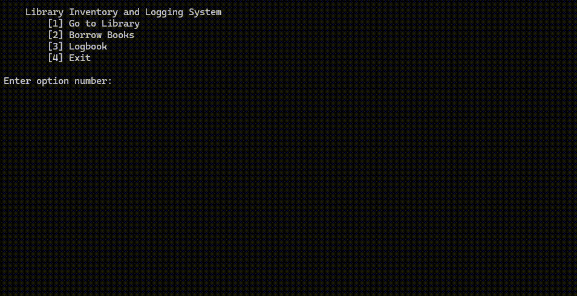
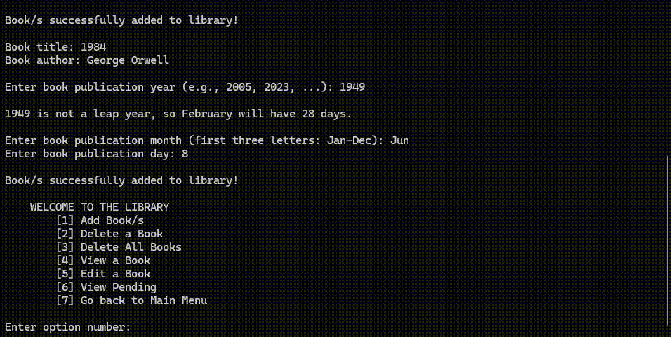
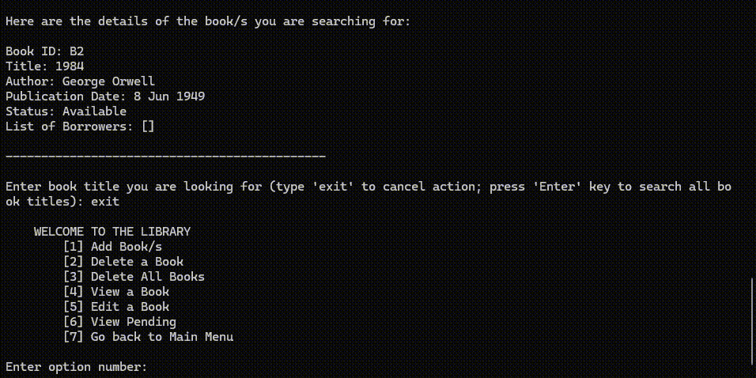
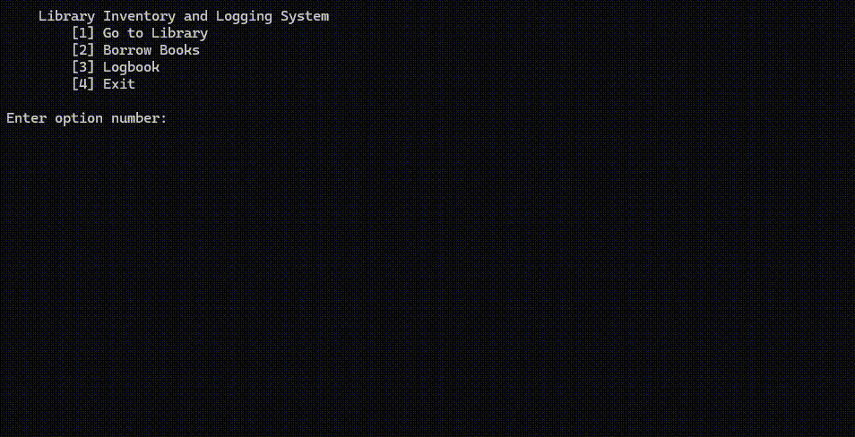
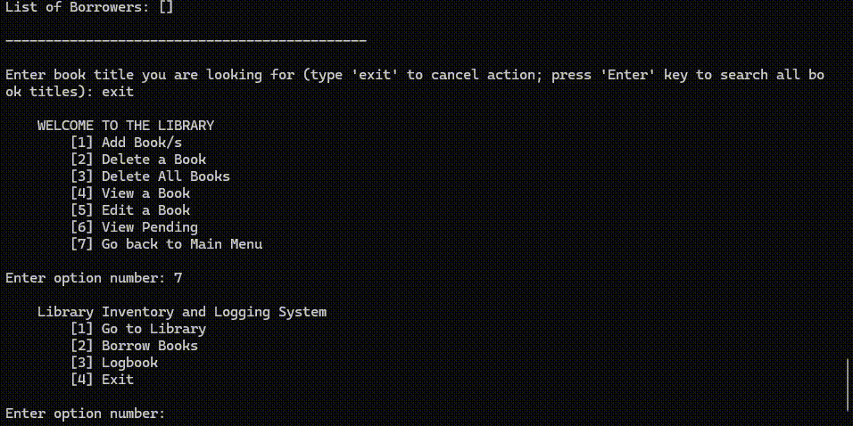
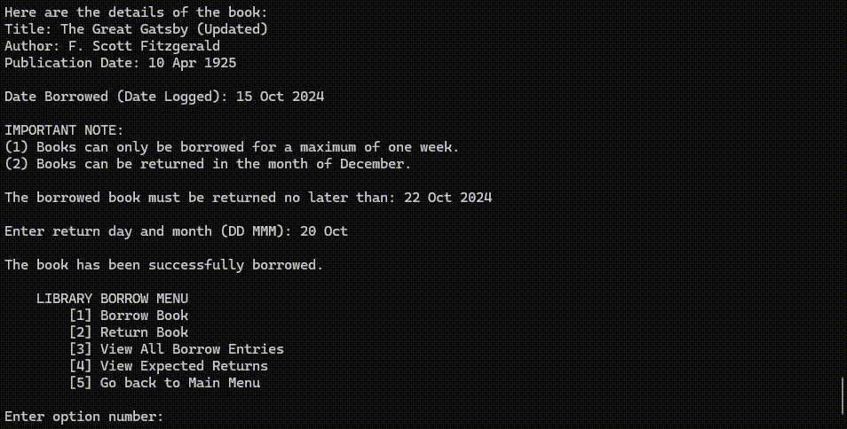
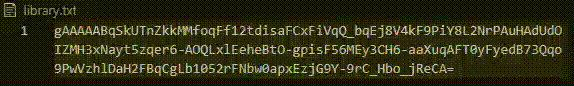

# 📚 Terminal-Based Library Management System


A robust, secure, and interactive Command Line Interface (CLI) application for managing library inventories, borrowing transactions, and visitor logs.

---

## 📖 Table of Contents

- [About the Project](#about-the-project)
- [Built With](#built-with)
- [Features](#features)
- [Visuals & Demo](#visuals--demo)
- [Installation](#installation)
- [Usage](#usage)
- [Technical Highlights](#technical-highlights)
- [Contributing](#contributing)
- [Contact](#contact)

---

## About the Project

This project is a comprehensive Python-based Terminal Library System designed to handle standard library operations securely. It was built to manage book inventories, track borrower deadlines (enforcing a strict **7-day borrowing policy**), and log all visitor transactions.

One of the core highlights of this system is its **data persistence and security**. All text-based databases (`library.txt`, `borrow_list.txt`, `logbook.txt`) are automatically generated and encrypted using symmetric encryption. This prevents sensitive library data from being manually viewed or modified outside the application.

---

## Built With

- Python 3
- Cryptography (Fernet)
- Command Line Interface (CLI)
- Text File Storage (can be .dat, but used .txt to view contents easily)

---

## Project Structure

```text
terminal-library-management-system/
├── .gitignore                # Git ignore rules
├── DeCastro_books.py         # Library inventory management
├── DeCastro_borrow.py        # Borrowing and returning logic
├── DeCastro_encryption.py    # File encryption and decryption (Fernet)
├── DeCastro_logbook.py       # Visitor logbook management
├── DeCastro_main.py          # Main entry point of the application
├── images/                   # images and GIFs used for the Demo
│   ├── library-crud.gif
│   ├── borrow-demo.gif
│   ├── logbook.png
│   └── encrypted-storage.png
└── README.md                  # Project documentation
```

---

## Features

- 🔐 **File Encryption** – Encrypts local database files when the application exits and decrypts them automatically upon launch.
- 📦 **Inventory Management** – Add, edit, delete, search, and view books while preventing duplicate entries.
- 🧠 **Smart Borrowing Logic** – Calculates valid due dates, handles leap years, and enforces a 7-day borrowing policy without external date libraries.
- 📝 **Digital Logbook** – Records visitor activity, borrowing, and returning transactions.
- 🛡️ **Robust Error Handling** – Prevents crashes caused by invalid input, missing files, or corrupted data.

---

## Visuals & Demo

### 1. Library Inventory Management (CRUD)

The library module supports complete **Create, Read, Update, and Delete (CRUD)** operations with built-in validation to prevent duplicate records and invalid user input.

* **Add Books**

Demonstrates adding one or more books to the library, automatically generating unique Book IDs, and validating publication dates (including leap year checks).

> **GIF:** Adding new books to the library.



* **View & Search Books**

Demonstrates viewing the complete library inventory or searching for specific books using substring matching on titles and authors.

> **GIF:** Viewing the complete inventory and searching for a specific book.



* **Update Book Details**

Demonstrates updating a selected book by its Book ID while validating the modified information before saving the changes.

> **GIF:** Updating a book's information.



* **Delete Books**

Demonstrates locating a book, confirming its Book ID, and permanently removing it from the library inventory.

> **GIF:** Deleting a selected book from the library.



---

### 2. Smart Borrowing System

Borrowing logic automatically limits users to a 7-day borrowing period, calculates the correct return date (including varying month lengths), and assigns a unique Borrow ID for every transaction.

> **GIF:** Authenticating a borrower and checking out a book.



---

### 3. Returning Books & Digital Logbook

When a borrower returns a book, the system validates the Borrow ID, updates the book's availability, and records the transaction in the digital logbook with the exact date and time.

> **GIF:** Returning a borrowed book and viewing the updated logbook.



---

### 4. Secure Encrypted Storage

All database files are encrypted using Fernet symmetric encryption whenever the application exits. A `try...finally` block ensures files are encrypted even if the terminal closes unexpectedly.

> **GIF:** The encrypted contents of `library.txt`, `logbook.txt`, and `borrow_list.txt` when opened.



---

## Installation

### Prerequisites

- Python 3.x
- `pip`

1. **Clone the repository**

   ```bash
   git clone https://github.com/vinvin-prog/terminal-library-management-system.git
   ```

2. **Navigate to the project folder**

   ```bash
   cd terminal-library-management-system
   ```

3. **Install the required dependency**

   ```bash
   pip install cryptography
   ```

4. **Run the application**

   ```bash
   python DeCastro_main.py
   ```

> **Note:** During the first run, the application automatically generates the required database files (`library.txt`, `borrow_list.txt`, and `logbook.txt`) along with the encryption key (`key.key`).

---

## Usage

After launching the application, you will be presented with the **Main Menu**.

- **Library** – Manage the library inventory through Create, Read, Update, Delete (CRUD), and search operations.
- **Borrow Books** – Borrow available books with automatic due-date computation.
- **Logbook** – Record visitor entries and view transaction logs.

> **⚠️ Security Notice**
>
> Do **not** delete or modify the `key.key` file. Losing this key makes the encrypted database files unreadable.

---

## Technical Highlights

- **Secure File Storage** – Applied Fernet symmetric encryption to protect all local database files while the application is not running.
- **Crash Protection** – Implemented a `try...finally` block to ensure database files are always re-encrypted before the program terminates, even during unexpected crashes or forced exits.
- **Data Persistence** – Stored all records using local text files while maintaining data consistency across program executions.
- **Input Validation** – Implemented extensive validation for dates, duplicate records, Borrow IDs, and user input to improve system reliability.
- **Python Data Structures** – Utilized dictionaries and lists to efficiently manage books, borrowers, and transaction records.

---

## Contributing

Contributions are welcome! If you have suggestions for improving the project, feel free to:

1. Fork the repository.
2. Create a feature branch.

   ```bash
   git checkout -b feature/AmazingFeature
   ```

3. Commit your changes.

   ```bash
   git commit -m "Add some AmazingFeature"
   ```

4. Push the branch.

   ```bash
   git push origin feature/AmazingFeature
   ```

5. Open a Pull Request.

---

## Contact

**Amiel Vincent De Castro**

- **GitHub:** https://github.com/vinvin-prog
- **Email:** avdc02@gmail.com

**Project Repository:** https://github.com/vinvin-prog/terminal-library-management-system
